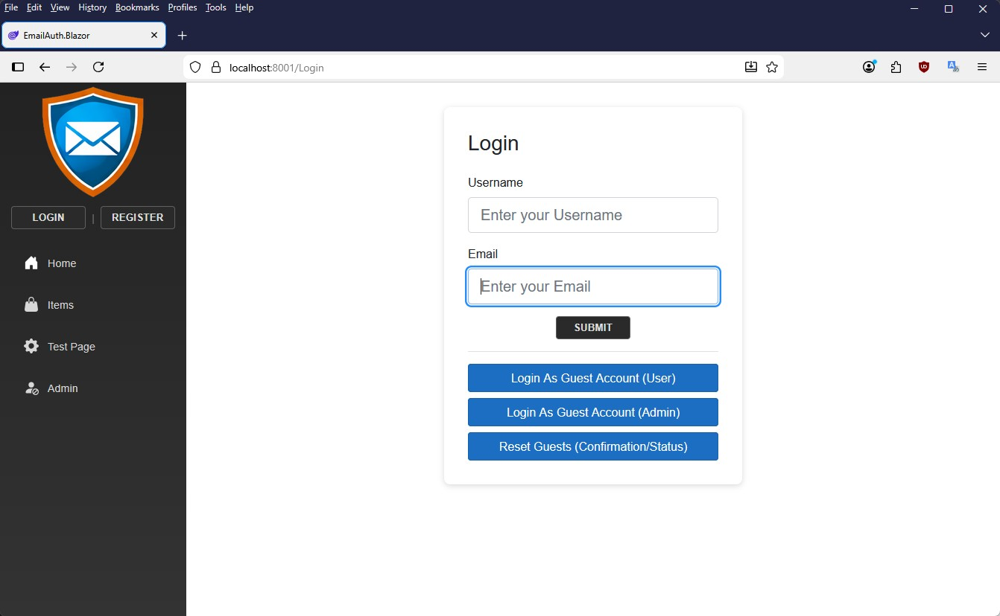

# EmailAuthDemo
A portfolio project that utilizes ASP.NET Core Web API and Blazor WebAssembly. 

The project is incomplete but it has the working custom passwordless jwt auth system already in place. The app has been prepared to be functional immediately after cloning using guest accounts with a "key" added to the secrets json [(secrets template)](https://github.com/Metalkon/EmailAuthDemo/blob/master/EmailAuth.WebApi/SecretsTemplate.json) though will require a gmail "app password" for the app to send emails and to create and use new accounts.

-----

## Simplified App Overview:

https://github.com/Metalkon/EmailAuthDemo/blob/master/EmailAuth.WebApi/SecretsTemplate.json

https://github.com/Metalkon/EmailAuthDemo/tree/master/EmailAuth.WebApi/Controllers/Account

https://github.com/Metalkon/EmailAuthDemo/tree/master/EmailAuth.WebApi/Services

https://github.com/Metalkon/EmailAuthDemo/tree/master/EmailAuth.Blazor/Pages/Account

https://github.com/Metalkon/EmailAuthDemo/tree/master/EmailAuth.Blazor/Services

**Register & Login**
- When the Register/Login Controller receives the users username and email, it generates a user object or confirms a matching user exists, does some checks and user status updates, and then sends a confirmation email containing a url to complete login/registration.
- When the user clicks the url sent to their email, it will direct them to the Blazor Confirmation page which automatically sends a confirmation http request to the respective controller.
- When the confirmation is recieved and everything passes checks, a jwt and refresh token is generated by the TokenService class and sent to the Blazor client to be saved to localstorage (will be changed in the future).
- If a user sends too many emails without a successful login, the account becomes locked and an email is sent which requires the owner of the email to confirm ownership by clicking a link to the confirmation page to unlock their email. No further emails will be sent until it has been unlocked.

**Token Management:**
- The authentication state is handled by a "CustomAuthStateProvider" which was picked up from elsewhere as i'm not familiar with this part of auth in blazor yet.
- The majority of http requests are made through the "HttpClientTokenService" service class, which replaces HttpClient in pages/services and acts as a middleman service that checks for jwt expiry and errors before each http request using HttpClient itself. When the jwt is expired it sends the refresh token to the Account Controller where it is confirmed to be valid before sending in a new jwt. If the refresh token is expired or the user account is suspended/banned then a jwt will not be sent to the Blazor client and the user is logged off.

**Notes:**
- Aside from the authentication system there is a simple CRUD item management page in this incomplete app, using the AdminItemController in the backend, and various components in the Admin page folder within the client app. A user management page will be added shortly after some salt and hash changes have been made to how users are saved in the database.
- The account and Items page have not been completed and will be added at a later date, for now only the Admin Page can be used for testing purposes.

