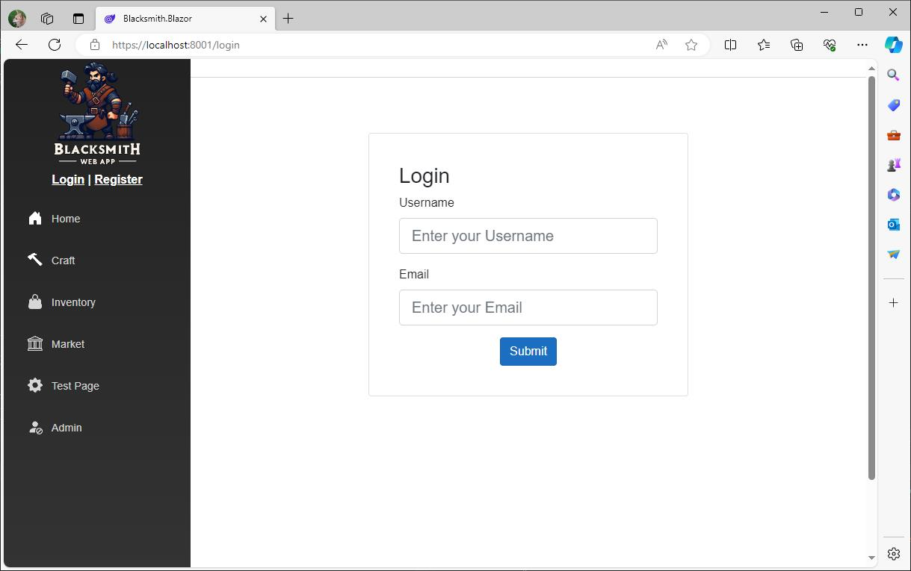

# Blacksmith-App
A portfolio project that I'm working on that utilizes ASP.NET Web API and Blazor WebAssembly (.NET8). 

The project is still a work in progress but it has a custom passwordless jwt auth system that I put together for users to login and register only using usernames and emails and I will soon start adding in more features and the blacksmith crafting web game itself.

-----

## Simplified App Overview:

### Auth System

**Register & Login**
- The Register/Login Controller receives the users username and email, generates a user object or confirms a matching user exists, does some checks and user status updates, and then sends a confirmation email containing a url to complete login/registration.
- When the user visits the url sent to their email, it will direct them to the Blazor Confirmation page which automatically sends a confirmation http request to the respective controller.
- When the confirmation is recieved and everything passes checks, a jwt and refresh token is generated by the TokenService class and sent to the Blazor client to be saved to localstorage.
- If a user sends too many emails without a successful login, the account becomes locked and an email is sent which requires the owner of the email to confirm ownership by clicking a link to the confirmation page to unlock their email. No further emails will be sent until it has been unlocked.

**Token Management:**
- The authentication state is handled by a "CustomAuthStateProvider" which was picked up from someone else's project as i'm not familiar with this part of auth in blazor yet.
- The majority of http requests are made through the "HttpClientTokenService" service class, which replaces HttpClient in pages/services and acts as a middleman service that checks for jwt expiry before each http request using HttpClient itself. When the jwt is expired it sends the refresh token to the Account Controller where it is confirmed to be valid before sending in a new jwt. If the refresh token is expired or the user account is suspended/banned then a jwt will not be sent to the Blazor client and the user is logged off.

### Blacksmith Game
- I will begin working on the crafting game shortly and it may take awhile to complete.

